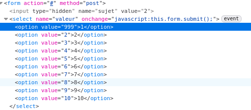

# No Input Validation

## Vulnérabilité

Sur la page `survey`, le formulaire utilise des `select` pour voter en donnant une note entre 1 et 10.

Il est possible de modifier le code front pour changer la valeur de la note dans le front.

Comme il n'a pas de validation en backend, on peut envoyer une note très haute et biaiser le sondage.

## Prévention

Implémenter une validation sémantique en backend

## Ressources

[owasp](https://cheatsheetseries.owasp.org/cheatsheets/Input_Validation_Cheat_Sheet.html)
