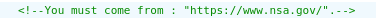

# Header Attack

## Vulnérabilité

Sur la page `/index.php?page=b7e44c7a40c5f80139f0a50f3650fb2bd8d00b0d24667c4c2ca32c88e13b758f` dans les commentaire du code HTML, on nous dit bien gentillement qu'il faut venir de `www.nsa.gov/` et utiliser le naviguateur `ft_bornToSec`




Ces informations sont passées dans la requête via les headers `User-Agent` (pour le navigateur) et `Referer` pour le sit d'où on vient.

On va créer une requête en utilisant les valeurs données.

```shell
  $> curl --silent --referer 'https://www.nsa.gov/' --user-agent 'ft_bornToSec' 'http://10.13.200.37/index.php?page=b7e44c7a40c5f80139f0a50f3650fb2bd8d00b0d24667c4c2ca32c88e13b758f' | grep flag
  [...]
  The flag is : f2a29020ef3132e01dd61df97fd33ec8d7fcd1388cc9601e7db691d17d4d6188
  [...]
```


## Prévention

Vérifier certains headers contre une whitelist
Ne pas implémenter une régle de sécurité se basant sur un header
